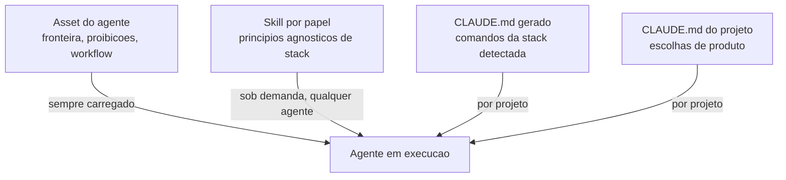

# ADR: convergência do harness pessoal para o trackfw

> Date: 2026-07-26 | Status: Accepted

## Context

O trackfw nasceu da prática de governança do projeto CMDB e do conjunto de agentes conhecido como
"Panteão Grego" (14 agentes em `~/.claude/agents/`), somados a `~/.claude/CLAUDE.md` (284 linhas) e
21 skills pessoais (2.518 linhas). Hoje esses artefatos vivem **fora** do produto: o trackfw entrega
10 agentes de ~360 bytes cada, em inglês, sem regras de kanban, git ou coordenação.

O objetivo é usar **somente o trackfw** como harness, aposentando os artefatos pessoais. Isso exige
trazer para o produto o que há de melhor no harness pessoal e resolver os conflitos entre as fontes.

### Diagnóstico levantado

1. **O harness do panteão não é uniforme.** `LOCK DE MODO`, `memory: project`, `tools:` e registro de
   contexto existem em 14/14 agentes; mas **KANBAN e GIT_FLOW existem em apenas 2/14** (afrodite,
   artemis) e o vault em 3/14. Seis implementadores com `Edit/Write` não têm nenhuma regra de kanban.
   Portanto "trazer o harness do panteão" é, na prática, **definir uma vez e aplicar a todos**.

2. **Lacuna de produto.** O bloco de pré-requisito KANBAN do `artemis.md` é exatamente o que a
   validação `branch_has_wip_roadmap` já impõe — mas os assets entregues ao usuário não mencionam a
   cadeia ADR→REQ→ROADMAP além da frase "preserve trackfw traceability".

3. **A dimensão por agente está morta.** Investigação no CMDB (`git log --diff-filter=A`): nos
   últimos 7 dias, **63 artefatos criados e zero sob agente nomeado**; nos últimos 30 dias, 287
   criados e apenas 2 sob agente nomeado. As 11 REQs mais recentes já nasceram flat na raiz.

4. **13 conflitos de comportamento**, vários internos ao próprio harness pessoal: três regras
   incompatíveis de nome de branch, três donos diferentes da criação de branch, três formatos de
   mensagem de commit, dois gates de validação sem precedência declarada e duas listas fechadas
   divergentes de trivialidade.

5. **Mecânica favorável.** `scripts/sync-integration-assets.sh` gera npm e pypi a partir da árvore
   canônica e `check-integration-assets.sh` valida byte-identity em `make quality`. Enriquecer os
   assets custa **uma árvore**, não 30 arquivos — e propaga para os 9 targets do catálogo.

## Decision

Adotar o harness do Panteão Grego como base do trackfw, normalizado e neutralizado de stack,
conforme as 17 decisões abaixo.

| # | Decisão | Detalhe |
|:-:|---|---|
| **D1** | **Default para todos os usuários** | O harness completo vira o comportamento padrão. Perfis opt-in ficam fora de escopo — não se cria a capacidade de corpo variável no catálogo. |
| **D2** | **Assets em inglês** | Preserva o alcance do open-source. O mandato "100% PT-BR" do panteão é descartado; idioma e persona voltam via `--preset` e via o CLAUDE.md do projeto. |
| **D3** | **Assinatura mantida, em inglês** | Sem preset: `— Architect, Principal Software Architect`. Com `--preset greek`: `— Zeus, …`. |
| **D4** | **Layout flat** | `docs/roadmaps/<estado>/` + `docs/req/`, que já é o default implementado. `roadmap_namespacing: by_agent` permanece disponível como opção de configuração. |
| **D5** | **Exceção de trivialidade mantida** | Vale a lista fechada de 5 dispensas e o fix direto para bug concreto reportado. Descarta-se a regra "o agente deve recusar mesmo se o usuário pedir". Exige cláusula de precedência explícita. |
| **D6** | **Vocabulário Waves + MLs** | Uma wave é um conjunto de MLs paralelos com barrier. Adota-se o frontmatter YAML (`req_id`, `status`, `responsavel`) para o gate funcionar. Descarta-se "FASES/MICROLOTES". |
| **D7** | **Seis estados** | `analyzing` entra no validator, alinhando validator, board, scaffold e codex. Semântica prospectiva: `analyzing` = planejando; `wip` = codando com branch ativa, tornando o `wip_limit` honesto. |
| **D8** | **Vault de conhecimento como conceito de primeira classe** | `trackfw init` cria `vault/notes/index.md`; regra na camada universal; comando `trackfw note new`; regra `note_orphan` no validator. Sem dependência de plugin. |
| **D9** | **`iac` como papel canônico novo** | Requer declarar a fronteira `infra` × `iac`, hoje inexistente. |
| **D10** | **Verticais de domínio ficam fora** | ITIL/CMDB e NetSuite não entram no produto. Resíduo assumido: 2 agentes locais. |
| **D11** | **Skills técnicas como família nova por papel** | Arquivos próprios em `assets/skills/`, ao lado das 5 de processo. Não são apensadas às existentes: as atuais organizam-se por verbo/fase (transversais) e as técnicas por domínio/papel. |
| **D12** | **Curadoria agnóstica de stack** *(emendada — ver D12-bis)* | Atravessam princípios universais (RFC 7807, SOLID, 12-Factor, WCAG 2.2 AA, web-first assertions, least privilege, idempotência). O específico de stack migra para o CLAUDE.md do projeto. |
| **D12-bis** | **Emenda: vocabulário de domínio é permitido; escolha de stack do projeto não** | Ver seção "Emenda D12-bis" abaixo. |
| **D13** | **`trackfw ship` agnóstico de forge** | Precedência: flag `--forge` → campo `forge:` no `trackfw.yaml` → parse do host de `git remote get-url origin` → CI detectado pelo `discover` → modo manual (imprime URL, não falha). |
| **D14** | **Branch `feat\|fix\|refactor/<slug>`** | O padrão data-`YYYY-MM-DD` do `git-rules` é legado e quebra a validação `branch_has_wip_roadmap`. |
| **D15** | **Conventional Commits puros** | Sem sufixo de nome de agente e sem trailer de modelo hardcoded. |
| **D16** | **`trackfw validate` é o gate único** | Substitui o script `validate-kanban-gate.mjs`. |
| **D17** | **Artefatos sempre via CLI** | `trackfw req\|roadmap\|adr new` — nunca criação manual, garantindo `req_id`, frontmatter e pareamento. Quem cria branch é o agente orquestrador. |

### Emenda D12-bis (2026-07-26, durante a execução da Wave 4)

**Contexto da emenda.** D12 foi aplicada como "zero nome de tecnologia" nos MLs 1A, 2A, 2B e 3B, e
funcionou bem para `backend` e `frontend` — ArangoDB e Module Federation são de fato escolhas de um
projeto, não vocabulário do papel. A regra **colapsa**, porém, em `iac` e `tooling`, onde a
tecnologia é o próprio domínio: medido na skill de origem, a estrutura inteira se organiza por
tecnologia (`Estrutura padrão de arquivos Terraform`, `AWS`, `EKS`, `AKS`, `GCP`). Uma skill de IaC
proibida de dizer "Terraform" reduz-se a princípios sem exemplo. O mesmo vale para `tooling` sem
poder citar MCP.

O sintoma já havia aparecido antes: `infra.md` cita `Kubernetes` (pré-existente) enquanto `iac.md`
nasceu sem citar nada — dois assets da mesma família com padrões diferentes.

**Decisão.** D12 passa a distinguir duas categorias:

| Categoria | Exemplos | Permitido |
|---|---|:-:|
| **Vocabulário de domínio** — padrão da indústria que define o papel | Terraform, OpenTofu, Ansible, Kubernetes, OpenAPI, RFC 7807, WCAG 2.2, MCP, Conventional Commits | ✅ |
| **Escolha de stack do projeto** — trocável sem mudar o papel | ArangoDB, Uber Fx, Gin, Entra ID, Module Federation, nomes de serviço | ❌ vai para o CLAUDE.md do projeto |

**Teste de decisão:** *trocar essa tecnologia mudaria o papel, ou apenas o projeto?* Trocar Terraform
por Pulumi continua sendo IaC — nomear a categoria é o que dá conteúdo. Trocar ArangoDB por
PostgreSQL não altera nada do papel `dba`.

**Consequência retroativa:** os 12 assets precisam ser uniformizados sob o novo critério (ML-5A).
`Kubernetes` em `infra.md` deixa de ser inconsistência e passa a ser conforme.

### Arquitetura em quatro camadas

| Camada | Carrega | Taxa de mudança | Consumido por |
|---|---|---|---|
| Asset do agente | Fronteira do papel, proibições, workflow, handoff | Raro | Só aquele agente, sempre |
| Skill por papel | Princípios de engenharia agnósticos de stack | Médio | Qualquer agente, sob demanda |
| CLAUDE.md gerado | Comandos da stack detectada | Por projeto | Todos, no projeto |
| CLAUDE.md do projeto | Escolhas de produto (ex.: ArangoDB, Entra ID) | Por projeto | Só aquele projeto |

### Camadas de harness nos agentes

- **Universal (todos):** LOCK DE MODO · registro em `agents-working-context.md` · `memory: project` ·
  `tools:` explícito · análise estática antes de editar · restrição de escopo e handoff · assinatura.
- **Adendo orquestrador (`architect`):** permissões git exclusivas (única entidade que cria branch e
  abre PR) · paralelização com waves, barrier e regras de spawn · workflow de 10 passos · auditoria
  de conformidade pós-ML · proibição de escrever código de produto.
- **Adendo implementador (demais):** KANBAN como pré-requisito (não editar sem REQ+roadmap em `wip`) ·
  proibição de criar branch e PR · protocolo de conclusão de ML (build → teste → gate → commit →
  push → atualizar roadmap) · build obrigatório antes de concluir.

## Consequences

### Positivas
- O produto passa a **ensinar a cadeia que já valida**, fechando a lacuna entre `branch_has_wip_roadmap`
  e o conteúdo entregue ao usuário.
- Cada melhoria propaga para **9 targets** (claude, codex, gemini, antigravity, cursor, copilot,
  windsurf, amazonq, kiro) editando uma única árvore.
- O harness inconsistente do panteão é **normalizado**: regras hoje presentes em 2/14 agentes passam
  a valer para todos.
- Regras de projeto hoje indevidamente alojadas em arquivos de agente (ArangoDB, Entra ID,
  `API_SPECIFICATION.md`) migram para o CLAUDE.md do projeto, corrigindo um defeito preexistente.

### Negativas e custos
- **D7 exige tocar o validator nos 3 CLIs** para admitir `analyzing` — e o estado tem 0 artefatos no
  CMDB nos últimos 30 dias, o mesmo critério de vacuidade que derrubou a dimensão por agente em D4.
  A decisão se sustenta apenas sob a semântica prospectiva declarada.
- **D9 custa 30 entradas de preset** (10 universos × 3 CLIs) e exige inventar nome para o papel em
  10 universos; `TestPreset_EveryPresetCoversExactlyKnownAgentIDs` falha até que todos existam.
- **D12 é curadoria manual**: estima-se que 40–50% das ~1.231 linhas de expertise atravessem.
- **D10 deixa resíduo**: 2 agentes permanecem locais e ficam órfãos de harness quando o CLAUDE.md
  pessoal for aposentado.
- **D3 exige código novo**: `render.go` só possui inserção de prefixo (`insertBodyPrefix`); não há
  mecanismo que anexe ao fim do corpo.
- **D8 exige que `note_orphan` nasça como `warning`**, não `error` — o CMDB tem 209 notas
  preexistentes e uma regra bloqueante fecharia o `trackfw validate` no dia 1.

## Alternatives Considered

- **Base neutra + perfil opt-in (`--profile governed`)** — rejeitada por custo: `catalog.json` tem um
  único `asset` por item e `Render()` não suporta corpo variável; seria capacidade nova nos 3 CLIs.
- **Manter os assets finos** — rejeitada: perpetua a lacuna entre o que o produto valida e o que ensina.
- **Expertise técnica no corpo dos agentes** — rejeitada: perde a carga sob demanda e o reuso
  cross-agent, e encarece o contexto mesmo em tarefas triviais.
- **Apensar as skills técnicas às 5 de processo** — rejeitada por mistura de eixos: `implement`
  passaria a conter Go, React, ArangoDB, Kafka e Playwright simultaneamente.
- **Portar as verticais (ITIL/CMDB, NetSuite) como papéis canônicos** — rejeitada: 60 entradas de
  preset para entregar a todo usuário do trackfw um agente de NetSuite e um de ITIL.
- **Manter o layout por agente** — rejeitada pela evidência empírica de uso zero.
